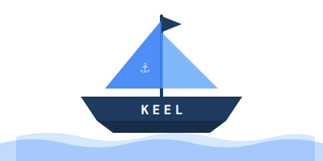

# Keel

Keel is a Go framework for building REST APIs with modular 
architecture, automatic OpenAPI, and built-in validation.

[](https://github.com/slice-soft/ss-keel-core/actions)

[](https://goreportcard.com/report/github.com/slice-soft/ss-keel-core)
[](https://pkg.go.dev/github.com/slice-soft/ss-keel-core)


## Features

- 🚀 **Quick Project Scaffolding** - Create new projects with best practices built-in
- 🧩 **Module Generation** - Generate controllers, services, repositories, and more
- 🔄 **Live Reload** - Built-in development server with hot reload
- ⚡ **Fast & Lightweight** - Written in Go, optimized for performance
- 📦 **Auto-updates** - Stay up-to-date with the latest features

## Installation

```bash
# Using Go install
go install github.com/slice-soft/ss-keel-cli@latest

# Or download from releases
curl -sSL https://github.com/slice-soft/keel/releases/latest/download/keel-$(uname -s)-$(uname -m) -o keel
chmod +x keel
sudo mv keel /usr/local/bin/
```

## Quick Start

### Create a new project

```bash
keel new my-app
cd my-app
```

### Generate a module

```bash
keel generate module users
```

This creates:
- `users/module.go` - Module definition
- `users/controller.go` - HTTP handlers
- `users/service.go` - Business logic
- `users/repository.go` - Data access layer

### Run development server

```bash
keel run
```

## Commands

### `keel new <project-name>`

Create a new Keel project with the complete structure:

```bash
keel new my-api
```

### `keel generate [type] [name]`

Generate different components:

```bash
# Generate a complete module
keel generate module posts

# Generate individual components
keel generate controller posts
keel generate service posts
keel generate repository posts
keel generate middleware auth
keel generate guard admin
keel generate dto create-user
keel generate crud products
```

### `keel run`

Start the development server with live reload:

```bash
keel run
```

### `keel upgrade`

Upgrade Keel CLI to the latest version:

```bash
keel upgrade
```

### `keel version`

Show the installed version:

```bash
keel version
```

## Project Structure

```
my-app/
├── main.go           # Application entry point
├── go.mod            # Go module definition
├── .env              # Environment variables
├── air.toml          # Live reload configuration
└── modules/
    └── users/
        ├── module.go      # Module registration
        ├── controller.go  # HTTP handlers
        ├── service.go     # Business logic
        └── repository.go  # Data layer
```

## Configuration

Keel projects use a `keel.toml` file for configuration:

```toml
[app]
name = "my-app"
version = "0.1.0"

[server]
port = 8080
host = "localhost"
```

## Contributing

Contributions are welcome! Please read [CONTRIBUTING.md](CONTRIBUTING.md) for details.

## License

MIT License - see [LICENSE](LICENSE) for details.

## Links

- 🌐 Website: [keel.slice-soft.dev](https://keel.slice-soft.dev)
- 📦 GitHub: [github.com/slice-soft/ss-keel-cli](https://github.com/slice-soft/ss-keel-cli)
- 📝 Documentation: [docs.keel.slice-soft.dev](https://docs.keel.slice-soft.dev)

---

Made with ⚓ by [slice-soft](https://slice-soft.dev)
